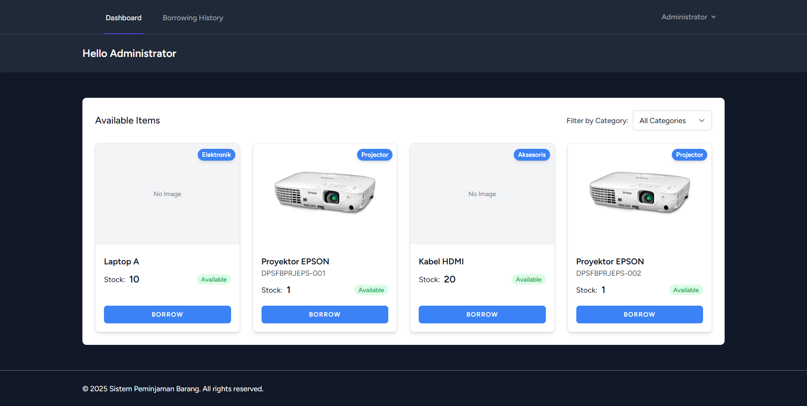
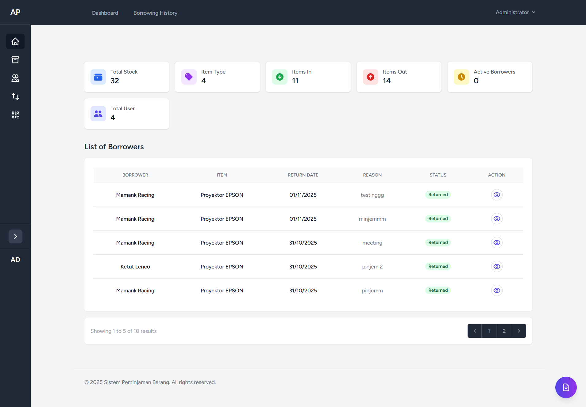
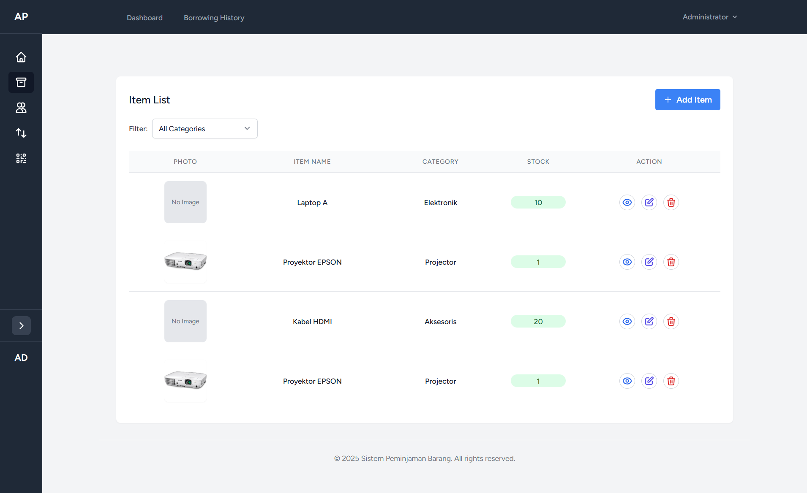
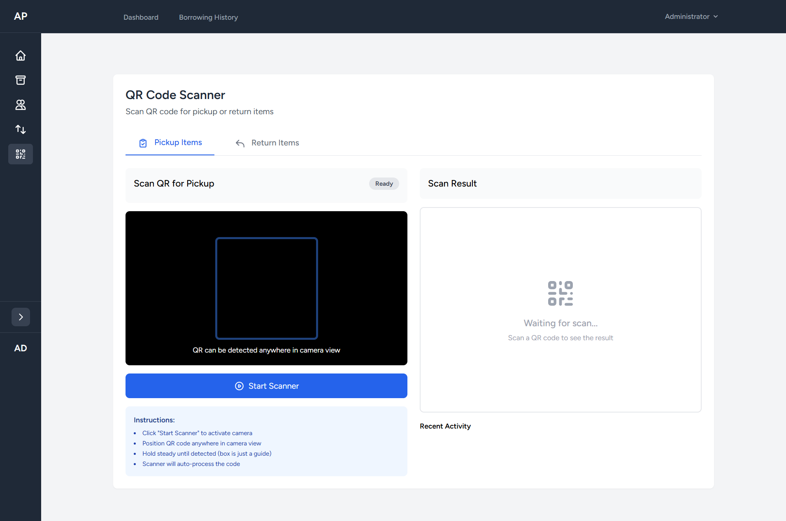
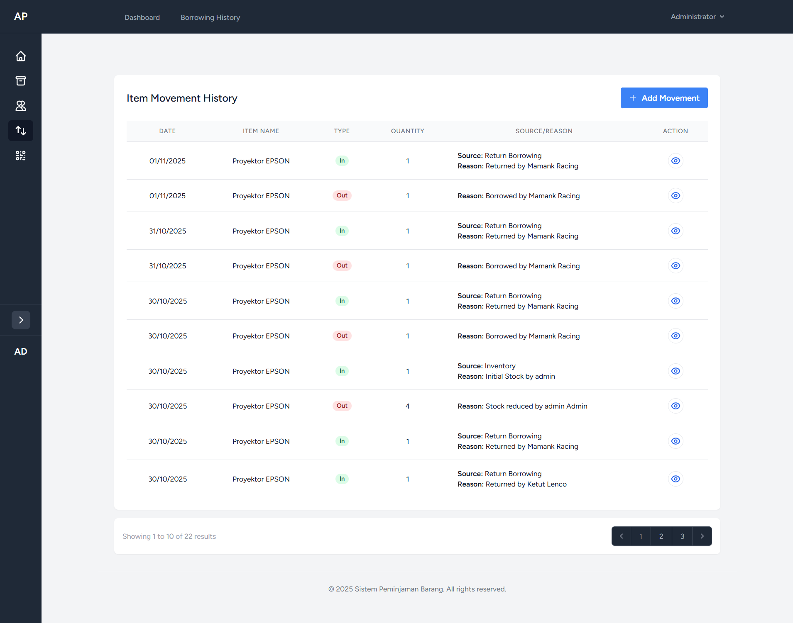
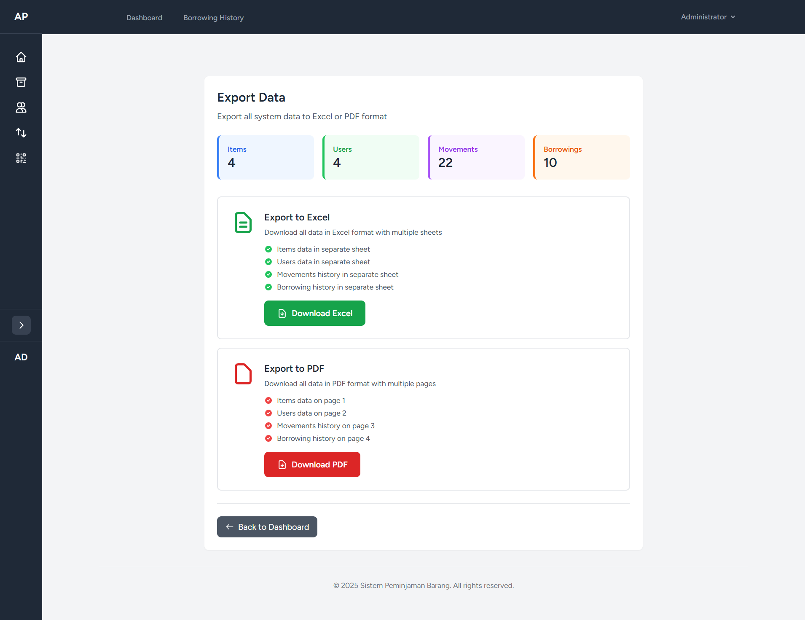

# 📦 Sistem Manajemen Inventaris dan Peminjaman Barang (Item Borrowing System)

<p align="center">
  
</p>

<p align="center">
  
  
  
</p>

## 📋 Deskripsi Project

Sistem Peminjaman Barang adalah aplikasi web berbasis Laravel yang dirancang untuk mengelola peminjaman dan pengembalian barang secara efisien. Sistem ini dilengkapi dengan fitur QR Code untuk tracking barang, laporan PDF, dan export data ke Excel.

NOTE: Project ini dibuat untuk keperluan Magang saya

## ✨ Fitur Utama

### 👤 User Features
- **Dashboard User**: Melihat daftar barang yang tersedia untuk dipinjam
- **Peminjaman Barang**: Submit request peminjaman barang
- **Riwayat Peminjaman**: Melihat history peminjaman dengan berbagai status
- **Receipt PDF**: Download bukti peminjaman dalam format PDF
- **Real-time Status**: Tracking status peminjaman (Pending, Approved, Borrowed, Returned, Rejected)

### 👨‍💼 Admin Features
- **Dashboard Admin**: Overview statistik sistem (Total Barang, Users, Peminjaman, dll)
- **Manajemen Barang**: 
  - CRUD barang dengan foto
  - Generate QR Code untuk setiap barang
  - Print QR Code
  - Serial number tracking
  - Stock management
- **Manajemen User**: CRUD user dengan role management (Admin/User)
- **Manajemen Peminjaman**: 
  - Approve/Reject request peminjaman
  - Tandai barang sebagai borrowed/returned
  - View detail peminjaman
- **Movement History**: Tracking pergerakan barang
- **Export Data**: Export data ke Excel (Barang, Users, Borrowings, Movements)
- **Search & Filter**: Pencarian dan filter data dengan mudah

## 🛠️ Tech Stack

- **Framework**: Laravel 12.0
- **PHP**: 8.2+
- **Database**: MySQL/PostgreSQL
- **Frontend**: 
  - Tailwind CSS
  - Alpine.js (via Laravel Breeze)
- **Packages**:
  - `barryvdh/laravel-dompdf` - Generate PDF
  - `maatwebsite/excel` - Export to Excel
  - `simplesoftwareio/simple-qrcode` - Generate QR Code
  - `laravel/breeze` - Authentication

## 📦 Instalasi

### Prerequisites
- PHP >= 8.2
- Composer
- MySQL/PostgreSQL
- Node.js & NPM

### Langkah Instalasi

1. **Clone Repository**
   ```bash
   git clone https://github.com/username/pkl-pinjam-barang.git
   cd pkl-pinjam-barang
   ```

2. **Install Dependencies**
   ```bash
   composer install
   npm install
   ```

3. **Environment Setup**
   ```bash
   cp .env.example .env
   php artisan key:generate
   ```

4. **Database Configuration**
   
   Edit file `.env` sesuai dengan konfigurasi database Anda:
   ```env
   DB_CONNECTION=mysql
   DB_HOST=127.0.0.1
   DB_PORT=3306
   DB_DATABASE=pinjam_barang
   DB_USERNAME=root
   DB_PASSWORD=
   ```

5. **Run Migration & Seeder**
   ```bash
   php artisan migrate --seed
   ```

6. **Storage Link**
   ```bash
   php artisan storage:link
   ```

7. **Build Assets**
   ```bash
   npm run dev
   # or for production
   npm run build
   ```

8. **Run Application**
   ```bash
   php artisan serve
   ```

   Aplikasi akan berjalan di `http://localhost:8000`

## 👥 Default Credentials

Setelah menjalankan seeder, gunakan credentials berikut:

**Admin:**
- Email: `admin@example.com`
- Password: `password`

**User:**
- Email: `user@example.com`
- Password: `password`

## 📁 Struktur Database

### Tables
- `users` - Data pengguna (admin & user)
- `barangs` - Data barang
- `borrowings` - Data peminjaman
- `movements` - History pergerakan barang

## 🎯 Cara Penggunaan

### Untuk User:
1. Login ke sistem
2. Browse barang yang tersedia di dashboard
3. Klik "Borrow Now" untuk mengajukan peminjaman
4. Tunggu approval dari admin
5. Lihat status peminjaman di "Borrowing History"
6. Jika status Waiting Pickup silahkan ke lokasi pengambilan barang

### Untuk Admin:
1. Login sebagai admin
2. Kelola data barang, user, dan peminjaman
3. Approve/reject request peminjaman
4. Tandai barang sebagai borrowed/returned
5. Monitor pergerakan barang di Movement History
6. Export data untuk reporting
7. Print Receipt ketika sudah mengapprove peminjaman
8. Scan QR untuk memvalidasi pengambilan barang dan pengembalian barang

## 📸 Screenshots

### User Dashboard 
Menampilkan daftar barang yang tersedia untuk dipinjam dengan informasi stok dan status untuk mengelola request peminjaman dengan status tracking.


### Admin Dashboard dan Borrowing management
Overview statistik sistem dengan chart, quick actions dan table borrower list.


### Item Management
Menampilkan daftar barang dengan fitur CRUD, QR Code generation, dan stock management.


### QR Code Feature
Generate dan print QR code untuk setiap barang untuk memudahkan proses validasi pengambilan barang dan pengembalian.


### Item Movement History
Tracking pergerakan barang dengan detail informasi peminjaman dan pengembalian.


### Export Data
Export data barang, user, peminjaman, dan pergerakan barang ke format Excel atau pdf untuk reporting.


dan masih banyak lagi fitur lainnya...

## 🔐 Security Features

- Authentication dengan Laravel Breeze
- Role-based Access Control (Admin/User)
- CSRF Protection
- XSS Protection
- SQL Injection Prevention
- Password Hashing

## 📱 Responsive Design

Aplikasi ini fully responsive dan dapat diakses dengan baik di:
- Desktop (1920px+)
- Laptop (1024px - 1919px)
- Tablet (768px - 1023px)
- Mobile (< 768px)

## 📝 License

Project ini adalah open-source software licensed under the [MIT license](https://opensource.org/licenses/MIT).

## 👨‍💻 Developer

Developed with ❤️ by Darma

## 📧 Contact
- Email: darmaputra2017@gmail.com
- GitHub: [@Amee30](https://github.com/Amee30)

## 🙏 Acknowledgments

- [Laravel](https://laravel.com) - The PHP Framework
- [Tailwind CSS](https://tailwindcss.com) - Utility-first CSS framework
- [Alpine.js](https://alpinejs.dev) - Lightweight JavaScript framework
- [Simple QR Code](https://www.simplesoftware.io) - QR Code generator
- [DomPDF](https://github.com/dompdf/dompdf) - PDF generator
- [Laravel Excel](https://laravel-excel.com) - Excel export/import

---

<p align="center">
  Made with ❤️ using Laravel
</p>
